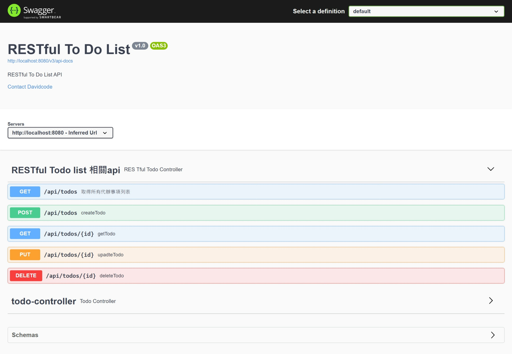
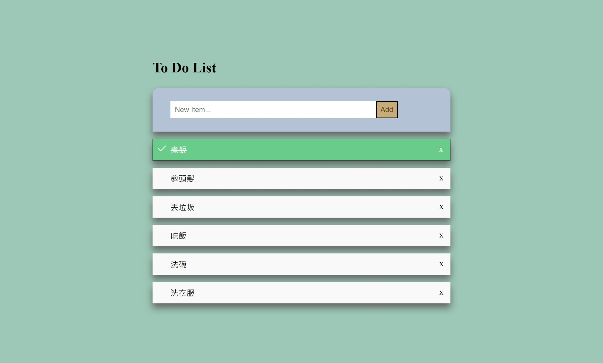

## RESTfulTodoList
三層式架構實作 RESTful Todo List

## 大綱
本專案利用[SpringBootTodoList](https://github.com/davidcode0128/SpringBootTodoList)，重新實作了 RESTful API 版本的 Todo List。
希望能夠藉由實作本專案，更加了解 Spring Boot 的運行機制以及 RESTful API 的設計。

## 做了什麼

1. 使用 MySQL 作為資料庫，並使用 Spring Data JPA 作為資料庫查詢語言，實現基本的CRUD功能。
2. 實作了 RESTful API 版本的 Todo List，並以 Swagger UI 及 Postman Agent 實做 API 測試。
3. 使用 JUnit5+Mockito 實作單元測試，並進一步使用 Junit5+MockMvc 實作整合測試。

## 環境

+ 作業系統 ： Linux Ubuntu 20.04
+ 開發與運行環境 : JDK-17
+ 資料庫 : MySQL 8.0
+ Spring Boot版本 : 2.7.3

## 配置

| 配置            | 描述                           | 版本         |
| --------------- | ------------------------------ |:------------|
| Eclipse         | 集成式開發環境                 | 2022-06      |
| Maven           | 專案管理                       | 4.0.0        |
| Tomcat          | 測試伺服器                     | 9.0          |
| Spring-MVC      | Spring+Mvc 框架基礎            |              |
| Spring-Boot     | SpringBoot2 基礎，應用、設定等 | 2.7.3        |
| Spring Data JPA | JPA 應用框架                   |              |
| JUnit           | 單元測試工具                   | 5            |
| MySQL           | MySQL 數據庫基礎               | 8.0          |
| Linux-system    | Linux 基礎，環境搭建、設定      | Ubuntu 20.04 |
| Thymeleaf       | XML/HTML5模板引擎              |              |
| Lombok          | Java library                   | 1.18.24      |
| Hibernate       | ORM 工具                       |              |
| Swagger UI      | RESTful API 文件工具           | 3.0.0        |

## 可以/希望改進的地方

+ ~~將 Swagger UI 更新為 3.0 版本~~ -- 2022/09/30 完成
+ 修改代辦事項內容功能
+ 實作會員新增帳號登入登出
+ 後台會員管理